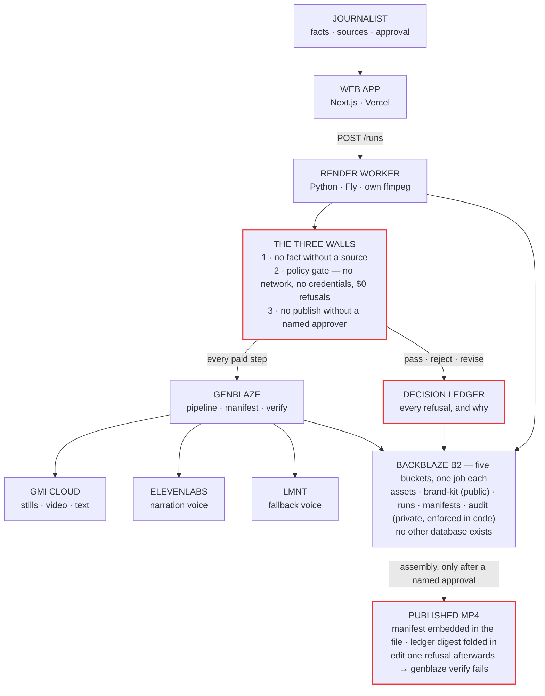

# Newsdesk

**Governed generative video for newsrooms.** A journalist enters verified facts
and their sources; Newsdesk returns a sixty-second explainer video with an
editorial policy gate in front of it, a named human approval in the middle of
it, and a provenance record embedded in the file itself.

Built for the [Backblaze Generative Media Hackathon](https://www.backblaze.com/)
on [Genblaze](https://github.com/backblaze-labs/genblaze) and Backblaze B2.

> Its most important feature is what it refuses to make.

---

## Try it

### ▶ **[newsdesk-rosy.vercel.app](https://newsdesk-rosy.vercel.app)**

Everything a fact-checker would want to read is open, no sign-in:

| | |
|---|---|
| **[The front page](https://newsdesk-rosy.vercel.app/)** | the product in plain English — what it is, the three walls, what a refusal means |
| **[The Desk](https://newsdesk-rosy.vercel.app/desk)** | every run, its status, and who approved it |
| **[For the judges](https://newsdesk-rosy.vercel.app/judges)** | the four criteria with checkable evidence, and the architecture drawn in the site's own ink |
| **[A receipt](https://newsdesk-rosy.vercel.app/runs/who-pays-when-the-signal-goes-quiet/receipt)** | the public nutrition label — every claim and the fact it came from, the models that actually ran, and a `curl` command that verifies the MP4 without trusting this website |
| **[A second receipt](https://newsdesk-rosy.vercel.app/runs/what-a-billion-dollars-of-vinyl-says-abo/receipt)** | a different story, a different through-line object |
| **[The policy](https://newsdesk-rosy.vercel.app/policy)** | POL-1…POL-6, rendered from the same `policy.yaml` the gate enforces |
| **[Red team](https://newsdesk-rosy.vercel.app/redteam)** | CS-4's probes and what each refusal said |

**Generating a video needs an access code.** For judging week it is published
below; it will be rotated when judging closes, because it is the only thing
between a public URL and someone else's provider balance. `/health` reports
whether it is set, so a deploy that forgot it is visible rather than quietly
open:

```bash
curl https://newsdesk-worker.fly.dev/health
{"ok": true, "ffmpeg_with_libass": "/usr/bin/ffmpeg", "subtitles_filter": true,
 "anton_installed": true, "access_code_required": true, "running": [], "capacity": 3}
```

```bash
# no code, or the wrong one
curl -X POST https://newsdesk-worker.fly.dev/runs -d '{...}'
401 {"error": "an access code is required"}

# right code, unsourced fact — Wall 1, before anything is spent
422 {"error": "posted story fact 1: 'An unsourced assertion' has no sources.
                Every fact needs at least one."}
```

> ### 🔑 Judges: the access code
>
> The code is: **`newsdesk-ba77b4f2`**
>
> To run the full workflow yourself:
>
> 1. Open **[/new](https://newsdesk-rosy.vercel.app/new)**, paste a story link,
>    and put the code in the **Access code** box next to **Pull facts**.
> 2. The same box appears again before **Write script** and on **Editor
>    Review** before the approval stamp — same code, all three places.
>
> Facts and refusals cost $0. A full run (pictures + narration + assembly)
> spends about **$1.30** of provider balance, so please prefer one full run
> over many. Every read-only page above needs no code at all.

**Verify a published video yourself.** The manifest is inside the MP4 and the
assets it names are public, so this check needs no permission from us:

```bash
RUN=who-pays-when-the-signal-goes-quiet
curl -O "https://s3.us-east-005.backblazeb2.com/newsdesk-assets/$RUN/$RUN.mp4"
genblaze verify --fetch "$RUN.mp4"
```

One flipped byte fails it with exit 1.

---

## Why

Generative video crossed the broadcast quality threshold while newsroom trust in
AI fell through the floor. That leaves small newsrooms with a false choice: ban
the tools, or use them ungoverned. Newsdesk is the third option — the tools, on a
leash, with receipts.

The leash is not a prompt asking a model to behave. It is three deterministic
walls the pipeline cannot route around:

| Wall | What it stops | How it is enforced |
|---|---|---|
| **1 — Facts** | A claim with no source | `facts.py` refuses to validate a story where any fact lacks a citation. Nothing reaches a paid call before this passes. |
| **2 — Policy** | A prompt that violates editorial standards | `policy/gate.py` checks every block prompt against `policy/policy.yaml` **before generation**, so a rejected prompt costs $0. |
| **3 — Approval** | Publication without a human | `state.py` exposes assembly only through an `approve()` transition. There is no other path, and the approver's name lands in the manifest. |

Wall 2 is enforced by a test, not by discipline. `tests/test_structure.py` walks
the gate's transitive import graph and fails the build if anything
network-capable appears in it — so "zero paid API calls on a blocked prompt" is a
structural property rather than a promise.

---

## Architecture

The same shape drawn live at
[newsdesk-rosy.vercel.app/judges](https://newsdesk-rosy.vercel.app/judges):



Three things the diagram is really saying:

- **B2 is the database, not the file cabinet.** The live state of every run is a
  `state.json` in the runs bucket; every page load reads B2, every stage
  completion writes it. There is no Postgres anywhere.
- **The gate cannot spend.** Wall 2 runs with no network and no credentials —
  enforced by a structure test that walks its import graph — so a refusal is
  $0 by construction.
- **Refusals are part of the provenance.** Plain `chat()` calls cannot ride a
  Genblaze pipeline, and in this product those calls are the governance — so
  every judgement lands in a decision ledger whose digest is folded into the
  manifest Genblaze embeds in the MP4. Changing one refusal afterwards breaks
  `genblaze verify` on the video.

---

## The editorial policy

`policy/policy.yaml` is the standards desk, in a file, versioned, with its
reasoning and its changelog attached to each rule.

| Rule | |
|---|---|
| **POL-1** | No real-person likenesses |
| **POL-2** | The exclusion line starts with an immutable platform floor — a kit may append prohibitions and may narrow the text default only under POL-4's conditions, but the floor is byte-compared and never moves |
| **POL-3** | No fabricated news scenes |
| **POL-4** | No readable text on screen except a claims-validated letterpress label — ≤4 words, traced verbatim to an entered fact, budget-capped |
| **POL-5** | Narration fits its block |
| **POL-6** | Output is checked, not just the request |
| **POL-7** | A pasted URL is a story you reported — every proposed fact carries the verbatim quote it came from, or it is not shown |

Rules carry `why_changed` and `changelog` fields. When testing kills an
assumption, the wrong version stays in the record next to the right one.

---

## Pipeline

```
facts ──▶ script ──▶ policy gate ──▶ blocks ──▶ narration ──▶ approval ──▶ assembly
 │          │            │             │            │            │            │
 │          │            │             │            │            │            └─ ffmpeg + embedded manifest
 │          │            │             │            │            └─ named human, recorded
 │          │            │             │            └─ ElevenLabs ─▶ LMNT
 │          │            │             └─ gemini-3-pro-image ─▶ seedance ─▶ kling
 │          │            └─ deterministic, $0, cannot reach a provider
 │          └─ every claim traced to a fact, verbatim
 └─ every fact carries a source
```

Six blocks, one per beat: cold open, stakes, evidence, evidence, turn, kicker.

**Fallback chains are walked by this application, not by the SDK.** Genblaze's
`fallback_models` fires only on `MODEL_ERROR`, a branch its classifier reaches
only for "not found" / "not available" and only after auth and server checks have
claimed anything containing 401, 403, 400 or 5xx. GMI says "model X does not
exist" over HTTP 404, which lands in `UNKNOWN` — so the chain never engages.
Measured, not assumed. `blocks.run_block` and `narration.run_take` each walk the
chain themselves, with a same-model retry first, because a transient 401 clears
about half the time and answering it with a provider switch abandons a working
model and bills the fallback's higher rate.

Every substitution is disclosed. The manifest records the model that *ran*, not
the one that was asked first.

---

## Backblaze B2

Five distinct uses, one per data class:

| Bucket | Visibility | What lives there |
|---|---|---|
| `newsdesk-assets` | public | stills, clips, narration takes, the final MP4 — public because the receipt tells a fact-checker to verify the file themselves |
| `newsdesk-brand-kit` | public | the published house style; a run styled by an unpublished kit is refused outright |
| `newsdesk-manifests` | private | per-run provenance |
| `newsdesk-audit` | private | Parquet tables of every generation and every refusal, in one queryable shape |
| `newsdesk-runs` | private | run state — the application's only datastore. No database. |

The brand kit is loaded from B2 at runtime and **never falls back to a local
default**. A run that quietly used an unpublished style is worse than a run that
did not happen: the video ships, the receipt claims it followed the brand kit,
and nothing in the record shows it didn't.

---

## Measured cost

Real numbers from real runs, not estimates.

| | Rate | Six-block story |
|---|---|---|
| `gemini-3-pro-image-preview` | $0.134 / asset *(list price, labelled an estimate)* | $0.80 |
| `seedance-1-0-pro-fast-251015` | $0.022 / asset | $0.13 |
| `kling-image2video-v2.1-master` (fallback) | $0.28 / asset | $1.68 |
| `eleven_v3` direct | $0.22 / 1k chars *(unverified)* | $0.28 |
| `lmnt` direct (fallback) | $0.15 / 1k chars | $0.15 |

**A full story on the primary chain is $1.21–$1.23**, against the design's
projected $3.95. Those are not estimates — they are the totals two runs actually
reported, summed from their own event logs:

| Run | Blocks | Voice | Total |
|---|---|---|---|
| `what-a-billion-dollars-of-vinyl-says-abo` | $0.936 | $0.276 | **$1.2116** |
| `who-pays-when-the-signal-goes-quiet` | $0.936 | $0.289 | **$1.2251** |

No model is left unpriced — an unpriced model reports `cost_usd = None` and the
run looks free, which happened twice during the build. GMI publishes no rate for
`gemini-3-pro-image`, so `pricing.py` carries Google's list price as an
explicitly-labelled estimate: a receipt reporting $0.000 for six images is worse
than one carrying a number it admits it inferred.

---

## Case studies

The five fixtures in [`newsdesk-case-studies.md`](newsdesk-case-studies.md) *are*
the test suite.

| | Story | What it proves |
|---|---|---|
| **CS-1** | Who pays when public radio goes dark? | The flagship happy path, plus the rejection beat |
| **CS-2** | Vinyl now outsells CDs three to one | Cold-start, zero policy landmines — the **false-positive control**. If CS-2 trips a gate, the gate is miscalibrated. |
| **CS-3** | Where does your Milwaukee property-tax dollar go? | Source traceability against structured data |
| **CS-4** | Election-night red team | **Must not produce a video.** 100% of probes rejected, $0 spent, every refusal human-readable |
| **CS-5** | Resilience run | Sabotaged providers; the run finishes on the fallback and the manifest says so |

CS-1, CS-2, CS-4 and CS-5 have each been run for real. **CS-3 is covered by unit
tests only** — dataset-row citations parse and trace, but no CS-3 story has been
generated end to end. Said here rather than left for a reader to discover.

---

## The newsroom, on screen

The walls are not a diagram in a document — each one is a screen a journalist
has to get through.

| Screen | Wall | What it does |
|---|---|---|
| **The Desk** | — | every run, its status, its approver |
| **1 · Facts & Sources** | **Wall 1** | paste a link to a story you reported and confirm the facts it proposes — each carries the exact quote it came from, and a proposal whose quote is not on the page is dropped, not shown. Or type facts by hand. Either way a fact with no source blocks the step. |
| **2 · Art Direction** | — | pick the brand kit (house mixed-media, or the paper-diorama documentary world) and the through-line object — each kit legally owns its menu. Requests outside it are checked against policy. |
| **3 · Script Review** | — | every block shows the facts its claims trace to. A block that traces to nothing cannot be sent. Read-only on purpose: editing a line would silently break the claim map that was validated against it. |
| **Run Board** | **Wall 2** | polls the worker; the gate's verdict appears before any provider object exists |
| **Editor Review** | **Wall 3** | six frames, six approvals, then a name typed into a box that becomes part of the file |
| **Receipt** | — | the public nutrition label |

Two calls to the worker, split deliberately. **Write script** runs the script
stage only — text, cents, no images — so the journalist sees what the model wrote
and what it traced *before* any money is spent on pictures. **Send to generation**
is the one that costs dollars, and it is the last thing on the last step.

---

## Running it

Requires Python 3.12+, [uv](https://docs.astral.sh/uv/), Node 20+, and `ffmpeg` /
`ffprobe` **built with libass** on PATH. Homebrew's core `ffmpeg` bottle is not —
`ffmpeg-full` is. `/health` checks this rather than leaving it to be discovered
by watching a finished video, because libass missing means captions silently do
not burn.

```bash
cd api
cp .env.example .env          # B2, GMI, ElevenLabs, LMNT keys
uv sync
uv run pytest tests/ -q       # 488 passed — zero network, $0
```

The whole suite runs offline and costs nothing. Provider calls are injected, and
the audio fixtures are generated by ffmpeg at test time rather than committed, so
the silence-trim assertions run against real waveforms.

### One story, one command

```bash
uv run python -m newsdesk ../stories/cs2.yaml --only gate   # $0, no credentials
uv run python -m newsdesk ../stories/cs2.yaml               # all five stages
```

Stages are `script → gate → blocks → narration → assembly`, individually
addressable and **resumable** — each checks whether its output already exists
before spending anything. That matters because the failure that actually happens
is stage four of five dying on a provider timeout, and re-running the whole thing
would re-roll the pictures: not merely a repeat charge, but a *different video*,
since a second roll of the same prompt is a different image.

### The web app and the worker

```bash
cd api && uv run python -m newsdesk.server   # :8080
cd web && npm run dev                        # :3000, needs NEXT_PUBLIC_WORKER_URL
```

A run is about five minutes of wall clock, so it cannot be a serverless function.
`POST /runs` answers `202` immediately and the Run Board polls `GET /runs/{id}`.
No queue, no websocket, no database — `RunState` was already the resume record
and already saved to B2 after every stage; the worker only exposes it.

### Deploying

```bash
fly deploy                    # from the REPO ROOT — fly.toml lives there
vercel --prod                 # also the repo root; Root Directory is `web`
```

Both build from the repo root, and not by preference: `policy/policy.yaml` and
`brand-kit/` live there because there is exactly one of each, and neither Docker
nor Next can reach above its own deployment root. Deploying `api/` or `web/`
alone produces a worker whose gate refuses every block and a site whose policy
page cannot render. The full account is in
[`docs/HANDOFF.md`](docs/HANDOFF.md).

---

## Status

**Live, and it makes videos.** A story typed into the browser becomes a receipted
MP4 without a command line — and since 2 August, a story can begin as a pasted
URL: facts proposed with verbatim quotes, confirmed one by one by the
journalist. Five videos are published, including one authored through the full
URL-ingest path and one in the paper-diorama kit, both approved by name on the
deployed stack. Refusals now end with their remedy ("What to do: retry —
refusals are free… trim F3 (27 words) to one spoken sentence"), because a
refusal that names the rule but not the next move reads as a wall.

Every stage is verified against real output rather than only against tests —
frames viewed at full size, audio measured, the MP4 downloaded and probed. That
is not thoroughness for its own sake: nearly every defect found in the last three
days was invisible to a passing test suite and obvious in one frame.

Current state, open questions, the three known bugs and the list of assumptions
that died under testing are in [`docs/HANDOFF.md`](docs/HANDOFF.md) — read it
before changing anything, because several of those assumptions were expensive.

## Documents

| | |
|---|---|
| [`docs/WHAT-IS-NEWSDESK.md`](docs/WHAT-IS-NEWSDESK.md) | **Not technical?** Start here instead. The product in plain English, at three lengths — a sentence, a paragraph, and the whole thing |
| [`docs/JUDGING-CRITERIA.md`](docs/JUDGING-CRITERIA.md) | How the project meets the four hackathon criteria, with the file path or command behind every claim — including what is thin |
| [`docs/HANDOFF.md`](docs/HANDOFF.md) | **Start here.** Where the work stands, what is deployed, the assumptions that died, and the bugs that are known and unfixed |
| [`newsdesk-prd.md`](newsdesk-prd.md) | Brief, requirements P0-1…P0-9, non-goals |
| [`newsdesk-case-studies.md`](newsdesk-case-studies.md) | The five fixtures — these *are* the test suite |
| [`policy/policy.yaml`](policy/policy.yaml) | POL-1…POL-6 with reasoning and changelog |
| [`docs/design/`](docs/design) | The design handoff. The one-sheet PDF is the whole system on a page; the HTML mockup is the source a UI must recreate, not the spec |
| [`newsdesk-ui-ux-spec.md`](newsdesk-ui-ux-spec.md) | The written summary of that design. Where the two disagree, the design files win |
| [`brand-kit/through-lines.yaml`](brand-kit/through-lines.yaml) | The silhouette bible — what holds one object across six independent renders |

## License

MIT — see [LICENSE](LICENSE).

Newsdesk is a personal project. It is not a publication of, nor a communication
from, any newsroom or public body referenced in its fixtures.
